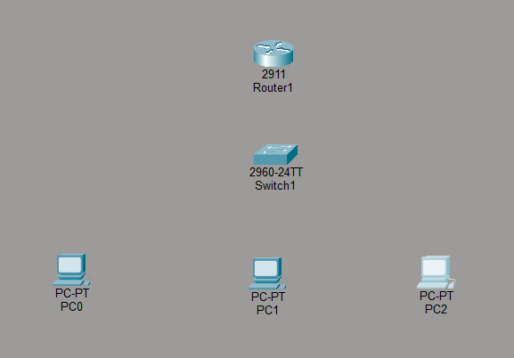
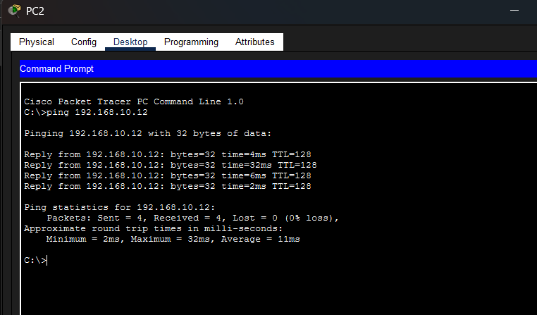
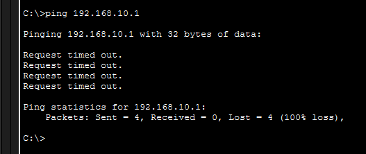
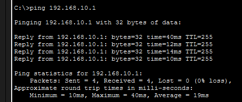

# Small Office Network Troubleshooting Lab

## Project Overview

This project demonstrates the configuration and troubleshooting of a small office network using Cisco Packet Tracer.

The network consists of:

* 1 Cisco 2911 Router
* 1 Cisco 2960 Switch
* 3 PCs

The objective was to configure connectivity between all devices, verify communication using ping, intentionally introduce a network issue, troubleshoot the issue, and restore connectivity.

---

## Network Topology

Router → Switch → PCs

### Devices Used

* Cisco 2911 Router
* Cisco 2960 Switch
* PC0
* PC1
* PC2

---

## IP Addressing Scheme

| Device | IP Address    |
| ------ | ------------- |
| Router | 192.168.10.1  |
| PC0    | 192.168.10.10 |
| PC1    | 192.168.10.11 |
| PC2    | 192.168.10.12 |

Subnet Mask:

255.255.255.0

Default Gateway:

192.168.10.1

---

## Configuration Tasks

* Connected devices using Copper Straight-Through cables
* Configured Router GigabitEthernet0/0
* Assigned static IP addresses to all PCs
* Verified connectivity using ping
* Tested network communication between devices

---

## Troubleshooting Scenario

### Problem

A network configuration error was intentionally introduced on PC1.

### Symptoms

* Connectivity issues observed
* Ping tests failed

### Troubleshooting Process

1. Used ping to test connectivity
2. Used ipconfig to inspect network settings
3. Identified incorrect network configuration
4. Corrected the configuration
5. Retested connectivity

### Resolution

The incorrect network configuration was corrected and full connectivity was restored.

---

## Skills Demonstrated

* Network Troubleshooting
* Cisco Packet Tracer
* TCP/IP Networking
* Router Configuration
* Switch Connectivity
* IP Addressing
* Connectivity Testing
* Problem Resolution

---

## Screenshots

### Network Topology

### Router Configuration

### Successful Connectivity Test

### Troubleshooting Investigation

### Issue Resolved

---

## Author

Mathapelo Mlilo
